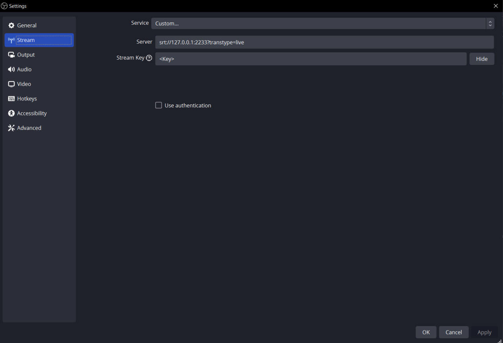
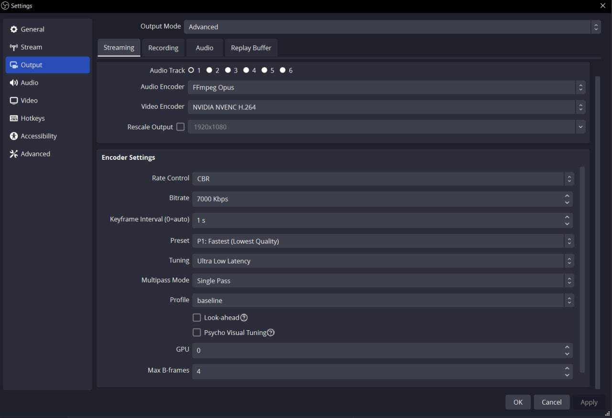

# Mugen

## Streaming
- Tested on my PC.
- No lags.
- No freezes.
- High quality (there are limitations, I guess).
- ***120***  FPS.
- ***Use FFmpeg AAC as audio encoder!*** . Otherwise audio won't work (not investigated yet)! *P.S.* on **2nd** screenshot other codec is set.

### OBS Stream Settings

### OBS output Settings

### StreamHost service
- Responisible for handling data passed by SRT connection from OBS.
- Recommended `SegmentDuration`=1000 (ms) and `SegmentsPerStream`>=10
